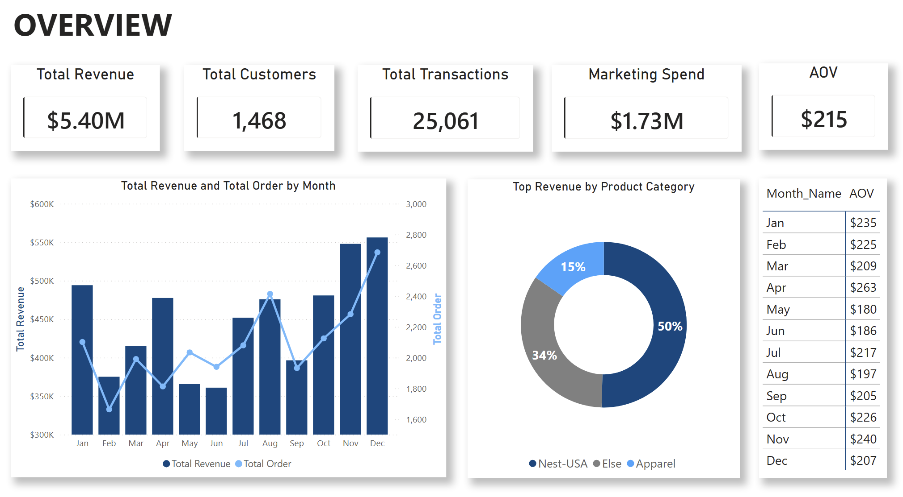
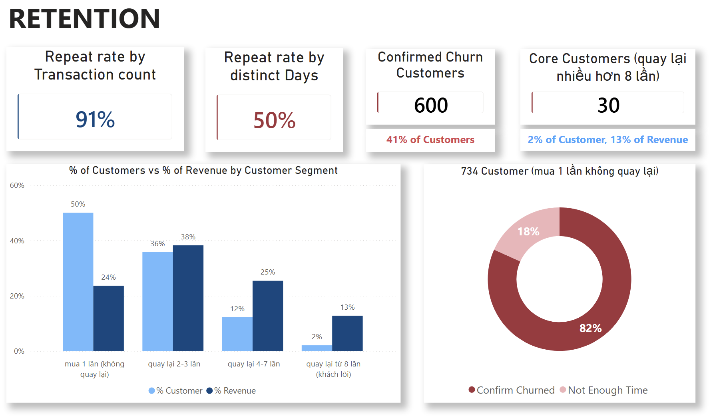
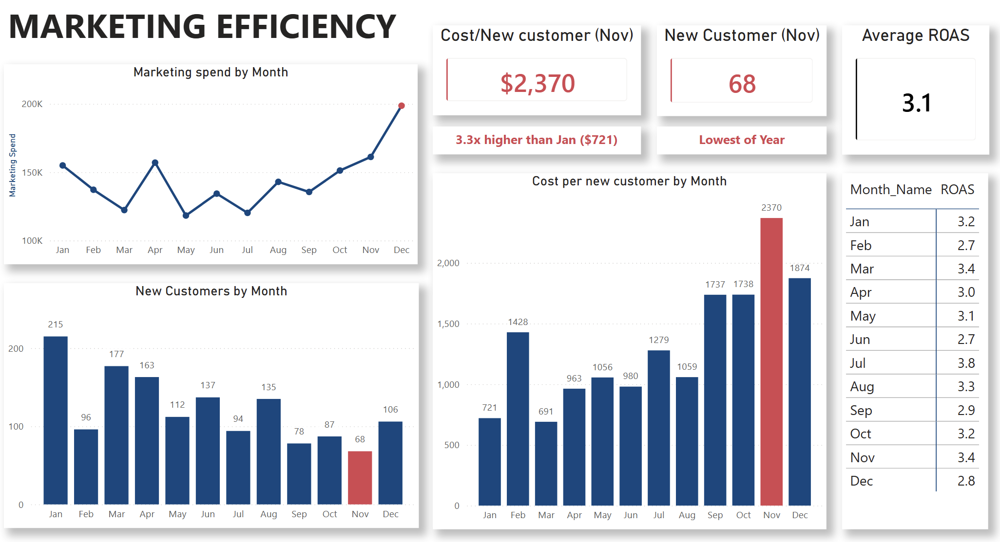

# Phân tích E-Commerce: Khi KPI "trông tốt" che giấu vấn đề thật về Retention và Marketing

**Công cụ sử dụng:** Python (Pandas) · SQL (MySQL) · Power BI · DAX

Dự án phân tích dữ liệu giao dịch e-commerce năm 2019 (nguồn Kaggle), nơi 2 chỉ số kinh doanh quan trọng nhất — **Repeat Purchase Rate** và **ROAS** — đều cho kết quả trông rất tích cực ở lần nhìn đầu tiên. Khi đào sâu vào cách 2 chỉ số này được tính ra, dự án phát hiện chúng đang đánh giá quá lạc quan so với thực tế ở 2 khía cạnh: tỉ lệ khách hàng rời bỏ và chi phí ngày càng tăng để có 1 khách hàng mới. Dự án trình bày toàn bộ quá trình phát hiện này, từ làm sạch dữ liệu → phân tích KPI bằng SQL → phân khúc khách hàng bằng Python → dashboard Power BI tương tác.

---

## 1. Bối cảnh

Hai chỉ số thường được dùng để đánh giá sức khoẻ của 1 doanh nghiệp e-commerce:

| Chỉ số | Cách tính phổ biến | Kết quả trên dataset này |
|---|---|---|
| Repeat Purchase Rate | % khách hàng có ≥2 đơn hàng | **91.5%** |
| ROAS (Return on Ad Spend) | Tổng doanh thu ÷ Tổng chi phí marketing | **3.10x**, ổn định suốt năm |

Nhìn vào 2 con số này, kết luận đưa ra sẽ là: khách hàng quay lại rất nhiều, và ngân sách marketing đang được sử dụng hiệu quả. Dựa trên đó, sẽ không có động lực nào để ưu tiên đầu tư vào retention, hay đặt câu hỏi về cách phân bổ ngân sách quảng cáo.

**Vấn đề mà dự án này đặt ra:** cả 2 chỉ số trên đều có thể đang che giấu thực tế.

- Repeat Purchase Rate được tính theo **số đơn hàng** (`Transaction_ID`). Cách tính này không phân biệt được 1 khách hàng quay lại 10 lần vào 10 ngày khác nhau với 1 khách hàng đặt 10 đơn nhỏ chỉ trong 1 lần ghé mua duy nhất — và hành vi thứ hai xuất hiện rất nhiều trong dataset này.
- ROAS được tính trên **tổng doanh thu**, bao gồm cả doanh thu từ khách hàng cũ mua lại. Một doanh nghiệp hoàn toàn có thể giữ ROAS ổn định trong khi chi phí để có **thêm 1 khách hàng mới** đang tăng lên đáng kể.

Dự án này tính lại 2 chỉ số ở mức chi tiết hơn, kiểm định lại kết quả để đảm bảo không phải do sai lệch thống kê, rồi chuyển thành đề xuất hành động cụ thể cho việc phân bổ ngân sách marketing.

---

## 2. Phương pháp thực hiện

| Giai đoạn | Nội dung thực hiện | Công cụ |
|---|---|---|
| **Phase 1 — Làm sạch dữ liệu** | Làm sạch 5 bảng dữ liệu gốc từ Kaggle (giao dịch, khách hàng, coupon, thuế, chi phí marketing), tính `Invoice_Value`, xây dựng star schema (1 bảng fact + 4 bảng dimension) | Python, Pandas |
| **Phase 2 — Phân tích KPI** | Truy vấn star schema bằng MySQL để tính các KPI tổng quan: xu hướng doanh thu, AOV, tỉ trọng category, repeat rate, ROAS | SQL (MySQL) |
| **Phase 3 — Phân khúc khách hàng & Kiểm định** | Phát hiện và xử lý lỗi dữ liệu (5.3% `Transaction_ID` bị gắn với nhiều khách hàng khác nhau), tính lại Frequency theo "số ngày quay lại khác nhau" thay vì "số đơn hàng", kiểm định lại xem tín hiệu rời bỏ phát hiện được có phải do thiếu thời gian quan sát hay không, và định lượng khoảng cách giữa ROAS với chi phí thu hút khách hàng mới | Python, Pandas |
| **Phase 4 — Dashboard** | Xây dựng báo cáo Power BI 3 trang, kết nối trực tiếp tới MySQL, với các DAX measure cho ROAS, repeat rate (cả 2 cách tính), và tỉ trọng doanh thu theo từng phân khúc khách hàng | Power BI, DAX |

📂 [`/notebooks`](notebooks) · 📂 [`/sql`](sql) · 📂 [`/data`](data) · 📂 [`/powerbi`](powerbi)

---

## 3. Phát hiện chính

### Phát hiện 1 — Repeat Purchase Rate bị đánh giá quá cao vì đếm theo đơn hàng, không phải theo lần quay lại thật

Trước tiên, dự án phát hiện 1 lỗi dữ liệu: 5.3% `Transaction_ID` bị gắn với nhiều hơn 1 `CustomerID` — nếu không xử lý, lỗi này sẽ làm sai lệch mọi phép đếm theo khách hàng. Sau khi sửa lỗi này, vấn đề thật sự mới hiện ra — có khách hàng đặt tới **139 đơn hàng riêng biệt chỉ trong 2 ngày**. Khi tính lại "Frequency" theo **số ngày khác nhau khách hàng thực sự mua hàng** (thay vì số đơn hàng), kết quả thay đổi hoàn toàn:

| Cách tính | Kết quả |
|---|---|
| Repeat Rate theo số đơn hàng | 91.5% |
| Repeat Rate theo số ngày quay lại khác nhau | **50.0%** |

Kết quả này đã được kiểm định lại để loại trừ khả năng sai lệch: liệu khách hàng gia nhập muộn trong năm (ví dụ tháng 11) chỉ đơn giản là chưa có đủ thời gian để quay lại? Khi chỉ xét những khách hàng đã có ít nhất 60 ngày để quay lại, **81.7% trong nhóm "chỉ mua 1 ngày" đã không quay lại quá 60 ngày** — xác nhận đây là vấn đề retention thật, không phải do thời gian quan sát chưa đủ.

Một nhóm khách hàng chỉ chiếm 2% nhưng quay lại từ 8 ngày khác nhau trở lên đóng góp **12.8% tổng doanh thu**, với giá trị trung bình mỗi khách **cao hơn 13 lần** so với nhóm chỉ mua 1 ngày.

### Phát hiện 2 — ROAS ổn định trong khi chi phí để có 1 khách hàng mới tăng gấp 3 lần

ROAS dao động trong khoảng 2.69x - 3.76x suốt năm 2019. Trong cùng giai đoạn đó, **chi phí để có thêm 1 khách hàng mới tăng từ $721 (tháng 1) lên $2,370 (tháng 11)** — tăng 3.3 lần. ROAS không phản ánh được điều này vì nó được tính trên tổng doanh thu (cả khách cũ và khách mới), nên doanh thu từ khách hàng cũ vẫn tiếp tục che lấp sự suy giảm thật trong việc thu hút khách hàng mới.

### Phát hiện 3 — Doanh thu phụ thuộc nặng vào 1 category duy nhất

Nest-USA chiếm tới **50.4% tổng doanh thu**, gấp hơn 3 lần category đứng thứ 2 (Apparel, 15.3%) — đây là rủi ro tập trung nếu nhu cầu của riêng category này biến động.

---

## 4. Dashboard

**[📊 Tải file Power BI đầy đủ](powerbi/ecommerce_dashboard.pbix)**

### Trang 1 — Overview


### Trang 2 — Retention: 2 cách đo "đã mua lại", 2 kết quả khác nhau


### Trang 3 — Marketing Efficiency: khi ROAS không kể hết câu chuyện


---

## 5. Đề xuất hành động

| Hạng mục | Phát hiện | Đề xuất | Mức ưu tiên |
|---|---|---|---|
| Phân khúc khách hàng | 2% khách hàng (nhóm "lõi") đóng góp 12.8% doanh thu, giá trị gấp 13 lần trung bình | Xây chương trình giữ chân/loyalty riêng cho nhóm này, không giảm giá đại trà | Cao |
| Phân khúc khách hàng | 600 khách hàng (40.9%) đã xác nhận rời bỏ thật, không phải do thiếu thời gian quan sát | Triển khai chiến dịch remarketing trong 30-60 ngày sau lần mua đầu tiên | Cao |
| Đo lường KPI | "Repeat Purchase Rate" theo đơn hàng đánh giá retention cao hơn thực tế khoảng 41 điểm % | Đổi định nghĩa KPI nội bộ sang đếm theo số ngày quay lại khác nhau, không đếm theo đơn hàng | Cao |
| Đo lường Marketing | ROAS và Cost-per-New-Customer biến động gần như độc lập với nhau | Theo dõi Cost-per-New-Customer song song với ROAS mỗi tháng, đặc biệt giai đoạn Sep-Nov | Cao |
| Phân bổ ngân sách theo thời gian | Doanh thu Q4 đã mạnh (29%); Q2 yếu nhất (22%) | Dịch chuyển 1 phần ngân sách từ Q4 sang Q2 để kích cầu | Trung bình |
| Phân bổ theo category | Nest-USA chiếm 50.4% doanh thu | Phân bổ thêm ngân sách marketing cho Apparel/Office để giảm rủi ro tập trung | Trung bình |
| Chất lượng dữ liệu | 5.3% `Transaction_ID` bị gắn với nhiều khách hàng | Báo lại cho bộ phận quản lý dữ liệu giao dịch để rà soát tại nguồn | Thấp |

---

## 6. Cấu trúc Repository

```
E-commerce-analytics/
├── data/
│   ├── raw/              # File gốc từ Kaggle
│   └── processed/        # Star schema đã làm sạch (1 fact + 4 dim)
├── notebooks/
│   ├── Phase_1_Data_Cleaning.ipynb
│   ├── Phase_2_SQL_KPI_Analysis.ipynb
│   └── Phase_3_Customer_Segmentation.ipynb
├── sql/                  # Câu query KPI dùng ở Phase 2
├── powerbi/
│   ├── ecommerce_dashboard.pbix
│   └── screenshots/
└── README.md
```

## 7. Kỹ năng thể hiện qua dự án

- **Làm sạch & mô hình hoá dữ liệu:** xây dựng star schema từ dữ liệu thô nhiều nguồn, xử lý logic kinh doanh (điều kiện áp coupon, tính thuế)
- **SQL:** viết query tổng hợp KPI trên mô hình dữ liệu quan hệ
- **Kiểm tra chất lượng dữ liệu:** phát hiện và xử lý lỗi tính toàn vẹn dữ liệu (referential integrity) thay vì bỏ qua
- **Phân tích khách hàng:** phân khúc theo kiểu RFM, kèm đánh giá lại xem chỉ số Frequency nào thực sự có ý nghĩa với đặc điểm riêng của dataset
- **Tư duy thống kê:** kiểm định lại 1 phát hiện để loại trừ khả năng sai lệch do thời gian quan sát trước khi đưa ra kết luận
- **Giao tiếp kết quả với người làm kinh doanh:** chuyển phát hiện kỹ thuật thành bảng đề xuất hành động có thứ tự ưu tiên rõ ràng
- **Xây dashboard:** thiết kế báo cáo Power BI, viết DAX measure, kể chuyện bằng dữ liệu qua nhiều trang
